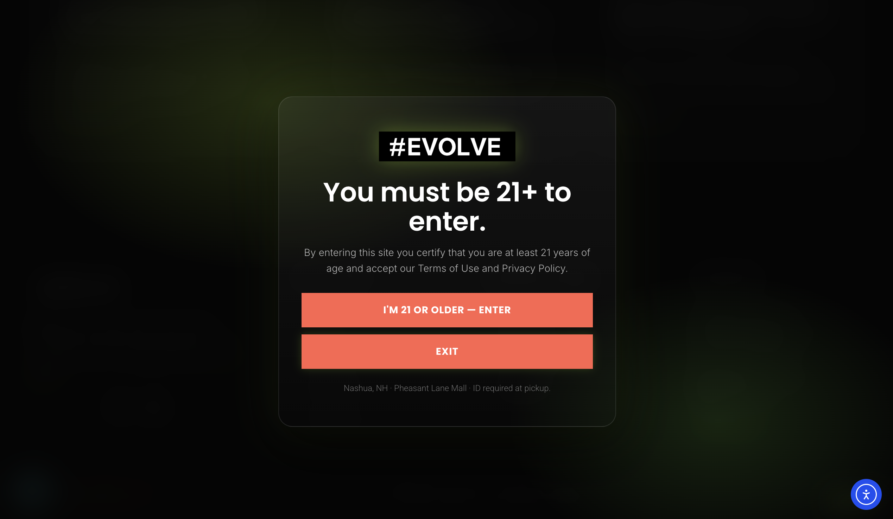
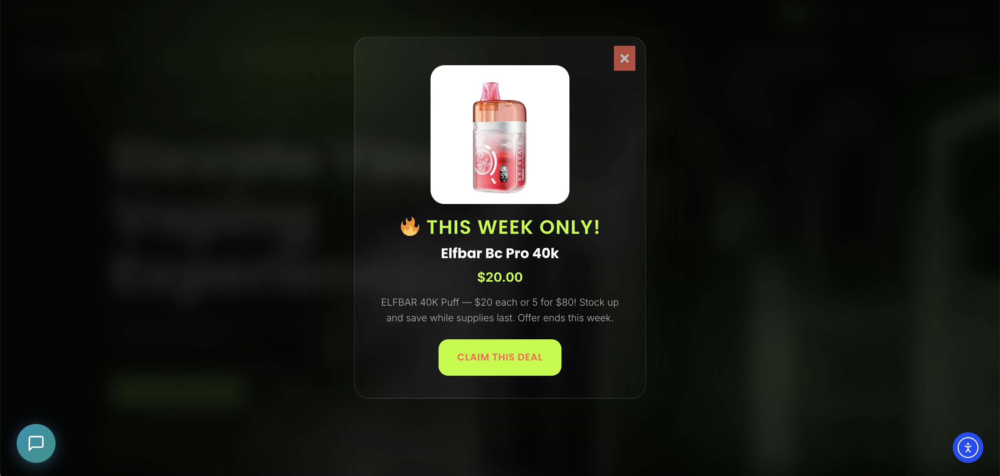
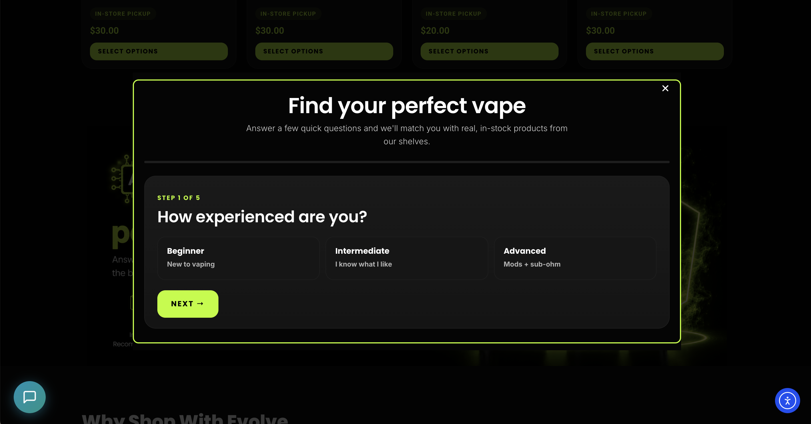

# Evolve Vapor — Custom WordPress & Elementor Development

A custom WordPress implementation for **Evolve Vapor**, built by **Hung Cao / Cao-Tech** with a Hello Elementor child theme, a companion plugin, and a separate AI-powered WooCommerce recommendation module.

This repository presents the custom development behind the website: reusable Elementor components, shared store information, responsive styling, WordPress admin tools, and integrations. The editing system lets staff manage content and settings through WordPress and Elementor while keeping common layouts and behavior in reusable code.

## My contribution

I built the child theme and custom plugins that connect the website's visual design to WordPress and WooCommerce. My work includes PHP plugin architecture, Elementor widgets and dynamic tags, JavaScript interfaces, responsive CSS, template import tooling, AI matching based on questionnaire answers, and an OmniSuggest AI search integration that matches customer search wording to catalog products.

The core plugin registers **5 custom Elementor widgets**, **4 dynamic tags**, and ships **20 JSON templates** for page layouts, Theme Builder components, popups, and global styling.

## Website screenshots

Screenshots of the implemented website, captured September 10, 2026. They document the interface at that time; production content and service configuration are separate from this source repository.

### Age confirmation interface

A custom dialog with entry and exit actions, a persisted confirmation state, and styling shared with the site.



### Configurable announcement dialog

An example of the site's reusable popup presentation and editable announcement content.



### Multi-step interface

The recommendation module's questionnaire interface, showing progress, selectable answers, and modal presentation.



## Content editing and maintenance

| Area | Implementation |
| --- | --- |
| Page layout | Elementor templates and reusable widgets provide editable sections with shared styling. |
| Store information | Dynamic tags expose address, phone, hours, and cart count to compatible Elementor fields. |
| Navigation | Custom shop menu and header search components integrate with the site layout. |
| Catalog content | WooCommerce owns product records; custom metadata supports the separate recommendation module. |
| Announcements | A WordPress settings screen controls the weekly popup's content and configuration. |
| Forms | A shared subscription handler serves both the Elementor widget and shortcode. |
| Template setup | An admin importer loads the bundled Elementor layouts. |
| Editor guidance | In-admin shortcode documentation provides a reference for supported components. |

## Custom Elementor integration

The core plugin adds an **Evolve** category to Elementor and registers these widgets:

| Widget | Technical purpose |
| --- | --- |
| Shop Filter | Filter controls connected to a custom AJAX query handler. |
| Header Search | AI-ranked product matches through OmniSuggest, with per-result explanations and a local search fallback. |
| Subscribe | Configurable form backed by the shared subscription implementation. |
| Vape Match Button | Connects Elementor layouts to the separate questionnaire interface. |
| Shop Menu | Reusable catalog navigation component. |

Four dynamic tags make shared values available inside Elementor: **Store Address**, **Store Phone**, **Store Hours**, and **Cart Count**. This avoids repeating the same store information manually across multiple layouts.

The 20 bundled JSON templates cover headers, footer, homepage, contact, default pages, blog views, search, 404, WooCommerce views, popup layouts, and a global style kit.

## Custom functions and modules

- **Age confirmation:** a PHP-rendered dialog, AJAX confirmation handler, configurable cookie duration, and configurable exit destination. This is a self-attestation interface, not identity verification.
- **Template importer:** an administrative tool for importing the project's bundled Elementor JSON templates.
- **WooCommerce integration:** theme support, shared WooCommerce styles, pickup notices, and custom display hooks.
- **AI product search and filtering:** a custom search handler connects customer queries to OmniSuggest AI, renders ranked results and explanations, and falls back to local WordPress search. Separate filter controls use dedicated PHP and JavaScript components.
- **Subscription handling:** optional GhostPilot Ghost-Convert integration, with a local lead-record and admin-email fallback.
- **Popup integration:** supporting code for connecting interface triggers and popup layouts.
- **Announcement and promotion modules:** existing settings, popup rendering, and WooCommerce cart hooks maintained in separate classes.
- **Reusable animation helper:** the `evolve_pulse` shortcode exposes animation options through a shared CSS system.
- **Responsive presentation:** child-theme styles, typography, layout rules, and JavaScript UI behavior.

## AI features

### AI matching based on user answers

The custom **Evolve AI Vape Match** plugin uses answers from a multi-step questionnaire to produce personalized catalog matches. The answer data includes experience, product type, flavor preferences, intensity preferences, budget, and brand preferences.

The implementation first selects and scores eligible WooCommerce catalog candidates. It then passes the user's answers and structured candidate data to OpenAI for re-ranking and short match explanations. The response supports a primary match, alternative matches, and a separate accessory group. Returned product IDs are validated against the supplied candidate lists before results are assembled.

The frontend presents the results through the custom questionnaire interface. A configurable rule-based fallback handles disabled or unavailable AI service calls.

### AI product search from customer wording

The custom **Header Search** widget integrates with **OmniSuggest AI** to match the customer's search wording to catalog products and display AI-ranked results with short explanations.

When its **Use OmniSuggest AI** option is enabled and the dependency is available, the Evolve search handler forwards the query to `/omnisuggest/v1/search-suggest`. It maps the returned product data and match reasons into the site's own result cards. The interface also handles the service's alternative-match flag. If the service is unavailable, fails, or returns no matches, the handler falls back to local WordPress product search.

This repository contains the Evolve widget, integration handler, and result presentation. The separate OmniSuggest plugin supplies the AI search engine and must be installed and configured independently.

### AI-assisted product metadata

The recommendation plugin also includes AI-assisted metadata filling. Its OpenAI client can read a product's title, description, categories, and tags and return structured fields used by the matching system. Product editing controls and bulk administration tools expose this functionality to staff.

This supports catalog maintenance alongside the customer-facing AI interfaces. The generated fields pass through the plugin's sanitization and metadata handling code.

### Implementation structure

`evolve-ai-vape-match` separates administration, product metadata, the REST endpoint, frontend questionnaire, rule-based candidate scoring, and the OpenAI client into dedicated modules. API credentials are configured in WordPress rather than bundled with the source.

## Project structure

```text
evolve-child/
  functions.php                 Theme setup, assets, and helpers
  style.css                     Child-theme metadata
  assets/css/                   Design system and WooCommerce styles
  assets/js/                    Frontend UI behavior
  assets/images/                Bundled branding

evolve-core/
  evolve-core.php               Plugin entry point
  includes/
    widgets/                    Five Elementor widgets
    dynamic-tags/               Four Elementor dynamic tags
    class-*.php                 Admin tools and feature modules
  assets/                       Module styles and scripts
  templates/                    Twenty Elementor JSON templates

evolve-ai-vape-match/
  evolve-ai-vape-match.php       Recommendation plugin entry point
  includes/                     Admin, metadata, REST, scoring, API client
  assets/                       Questionnaire and admin interface assets

docs/
  implementation-guide.md       Original build/setup documentation
  screenshots/                  Portfolio screenshots
```

## Code entry points

- [Core plugin initialization](evolve-core/evolve-core.php)
- [Elementor widget registration](evolve-core/includes/class-widgets.php)
- [Dynamic tag registration](evolve-core/includes/class-dynamic-tags.php)
- [Template importer](evolve-core/includes/class-template-importer.php)
- [Subscription integration](evolve-core/includes/class-subscribe.php)
- [Child theme setup](evolve-child/functions.php)
- [Recommendation plugin initialization](evolve-ai-vape-match/evolve-ai-vape-match.php)
- [REST interface](evolve-ai-vape-match/includes/class-rest-api.php)
- [AI matching and metadata client](evolve-ai-vape-match/includes/class-openai.php)
- [OmniSuggest AI search integration](evolve-core/includes/class-search.php)

## Technology and requirements

**WordPress · PHP · JavaScript · CSS · WooCommerce · Elementor · Elementor Pro · Hello Elementor · OpenAI API · OmniSuggest AI integration**

The core plugin declares WordPress 6.4+ and PHP 7.4+. The separate recommendation plugin declares PHP 8.0+ and WooCommerce 7.0+, so the complete build requires PHP 8.0 or later. Elementor Pro supplies the Theme Builder and popup functionality used by the layouts.

The three root ZIPs contain the supplied plugin and theme deployment packages. See the [original implementation guide](docs/implementation-guide.md) for the existing setup documentation and the [recommendation module documentation](evolve-ai-vape-match/README.md) for its implementation details. The original guide includes historical version notes; current component versions are declared in their entry files.

This repository contains custom source, templates, bundled assets, and portfolio screenshots. It does not include WordPress itself, licensed third-party plugins, the production database, customer records, or configured service credentials. The screenshots may show production content or third-party interface elements that are not supplied by these custom packages.

## Author

**Hung Cao — Cao-Tech**

Custom WordPress development, Elementor integration, PHP plugins, and maintainable website systems.
